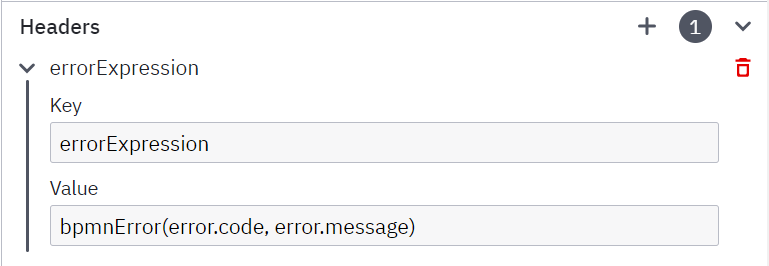
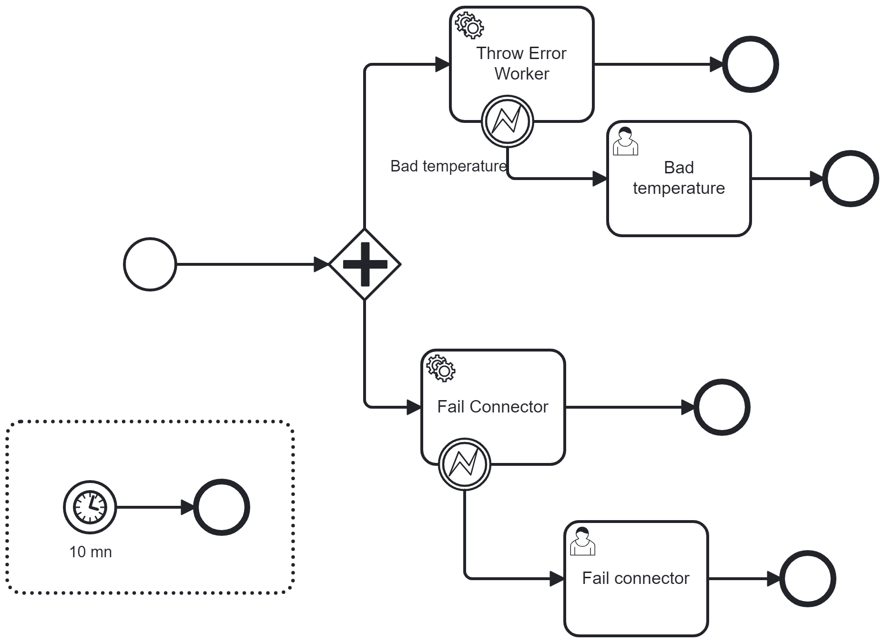

# How to throw an exception in a worker/connector

In your code, you want to throw an error.
Then, in the code, you want to capture this error as a BPMN error.

This project gives you the implementation of a worker and a connector.

# Worker

Visit io.camunda.connector.errors.explicitworker.FailExplicitWorker

In a worker, the BPMN error must be thrown explicitly via the code.

````java
     jobClient.newThrowErrorCommand(activatedJob.getKey())
           .errorCode(ERROR_BAD_TEMPERATURE)
          .send();
````

The worker can decide if the jobs will fail via the code.

`````java
     jobClient
          .newFailCommand(activatedJob.getKey())
          .retries(activatedJob.getRetries()-1)
          .errorMessage("BadTemperature")
          .send();
`````

# Connector
The connector code has only one possibility: throw an exception

````java
      throw new ConnectorException(ERROR_BAD_HUMIDITY, "Weather is rainy");
````

The runtime is responsible for transforming this exception into a BPMN error or failing the task.
For example, the Connector Runtime failed the task on a ConnectorException.

The connector runtime searches if an Error Expression (name `errorExpression` is defined on Headers.
If an expression exists, then it is executed. This FEEL expression must be defined to transform the error in a BPMN error:

````FEEL
bpmnError(error.code, error.message)
````

For example:


This field is often added in the element's template as a hidden field, so when you use the template, you don't see it.
If you want the connector to fail instead of throwing a BPMN error, unlink the template and remove that field.


Note: in case of a failed task, the connector can't pilot the number of retries, and the task fails immediately

# Conclusion

If your code needs more control, decide to Fail, or throw an exception, the worker API offers more options. In a worker, it's possible to fail x times and then thrown an exception.

The connector framework does not have all these options; it just throws an exception. It is the runtime that hosts the connector to decide what to do.

# How to run the test

Deploy the `ThrowsErrors.bpmn` process on a server and create a process instance.



Change the `application.yaml` file, giving the correct properties to contact your cluster

Start `io.camunda.errors.ErrorApplication`. This class uses the connector runtime library.
